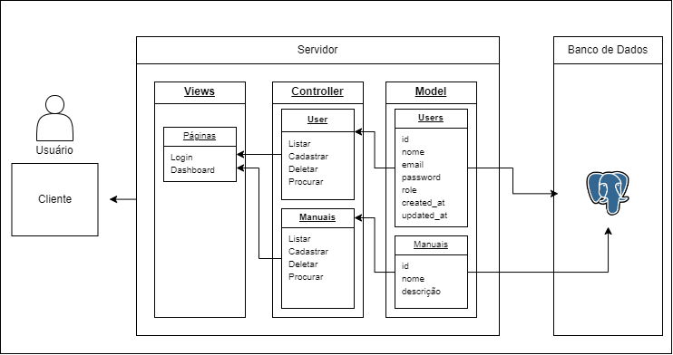

A diagramação abaixo utiliza o padrão de estruturação MVC, o padrão MVC é dividido em três componentes.
Model: Comunicação com o banco de dados.
View: Entrega a intêrface para o usuário.
Controller: Intermediário entre a View e a Model.

[Link para leitura](https://drive.google.com/file/d/1nf5gP0mLMxU7R2FbCIufo2RAXUwoKuzd/view?usp=sharing)

Realizei esta diagramação me baseiando nas duas principaís funcionalidades da aplicação web, a gestão e cadastro de usuários e cadastro/atualização dos manuais.

Na tabela users adcionei as seguintes colunas:
id: Chave Primária
name: Nome do usuário
email: E-mail do usuário
password: Senha do usuário
role: Nivel de permissão do usuário
created_at: Data/hora que foi criado no banco
updated_at: Ultima atualização deste registro 

Na tabela manuais adcionei as seguintes colunas:
id: Chave Primária
name: Nome do manual
descricao: Descrição do manual
created_at: Data/hora que foi criado no banco
updated_at: Ultima atualização deste registro 

